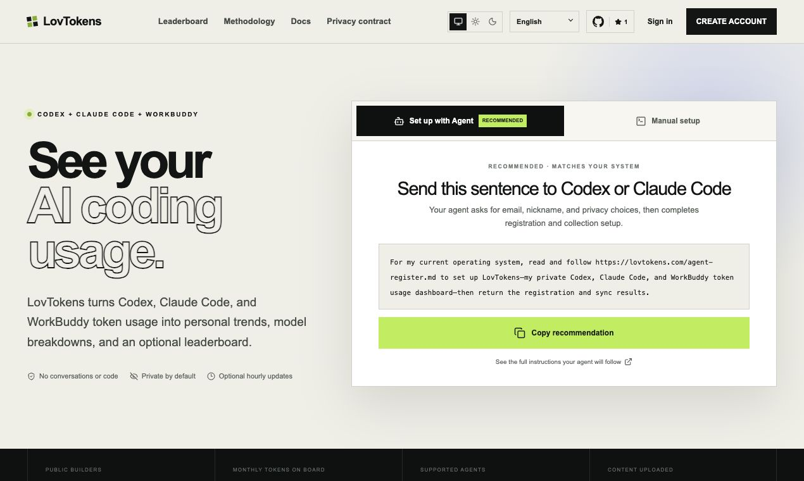
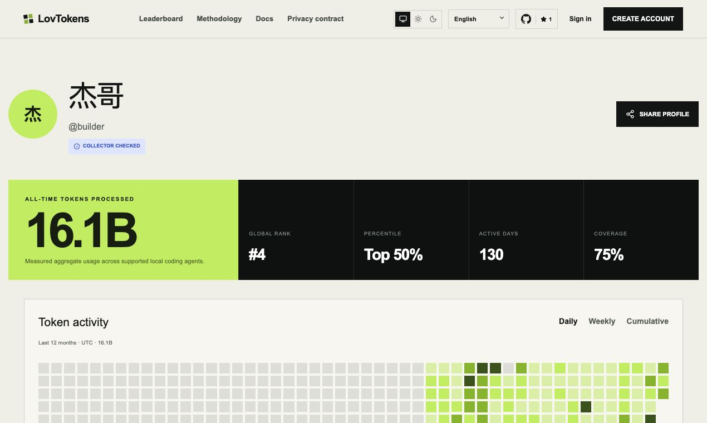
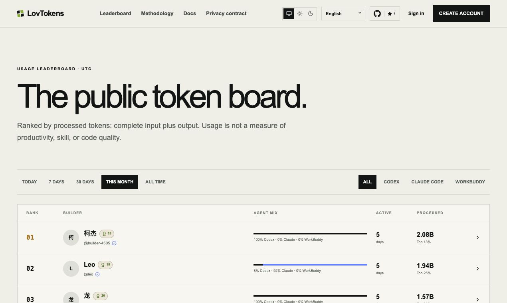

# LovTokens

> 你的 AI Token 资产组合。 / Your AI Token Portfolio.

[简体中文](#简体中文) · [English](#english) · [项目截图 / Screenshots](#项目截图--screenshots)

## 项目截图 / Screenshots

### 首页 / Home



### 公开主页 / Public profile



### 排行榜 / Leaderboard



### 成就徽章 / Achievement badges

30 枚固定徽章与持续解锁的月度收藏，让每一次 Token 轨迹都成为值得收藏的勋章。

30 permanent badges and continuously unlocked monthly collectibles turn every
token journey into an achievement worth keeping.


## 简体中文

LovTokens 会读取本地 Codex、Claude Code 和 WorkBuddy 会话文件中的汇总用量，
构建私有仪表盘，并提供用户主动加入的公开排行榜、公开主页、分享卡片和用量证书。

LovTokens 绝不会上传提示词、回复、源代码、仓库名称或文件路径。采集器完全开源，
你可以在发送数据前通过 `lovtokens show-data` 查看完整的上传内容。

### 工程结构

- `apps/web`：Next.js 应用与 Cloudflare API 路由。
- `packages/collector`：跨平台 `lovtokens` 命令行工具。
- `packages/token-schema`：带版本管理的用量数据结构与标准化工具。
- `migrations`：Cloudflare D1 数据库结构。

### 本地开发

```bash
pnpm install
cp apps/web/.env.example apps/web/.env.local
pnpm db:migrate:local
pnpm dev
```

本地 Web 应用和采集器默认使用 `http://localhost:3100`。浏览器端到端测试使用
独立的 `3107` 端口，不会复用已有服务。

在 localhost 环境中，邮箱和密码注册会自动启用，无需配置 GitHub OAuth。
生产环境中，在配置邮件验证服务之前，请保持 `EMAIL_PASSWORD_AUTH_ENABLED`
未设置或为 `false`；只有在明确需要启用此登录方式时，才将其设为 `true`。

账户相关路由包括 `/login`、`/register`、`/forgot-password` 和
`/settings/account`，并提供对应的 `/zh/*` 路由。配置 `RESEND_API_KEY`
和已验证发件人的 `AUTH_EMAIL_FROM` 后，即可启用验证邮件和密码重置邮件。
邮件服务配置完成后，新注册的邮箱和密码账户必须先验证邮箱才能登录。

如果没有 D1 绑定，公开页面会如实展示空状态。LovTokens 不会创建演示用户，
也不会伪造排行榜数据。

### 采集器

```bash
pnpm --filter lovtokens build
node packages/collector/dist/index.js show-data
node packages/collector/dist/index.js sync --dry-run
```

完整的 Agent 操作流程保存在 `apps/web/public/agent-register.md`，并发布在
`/agent-register.md`。首页仅提供一段简短说明，引导 Codex、Claude Code 或
WorkBuddy 读取该线上文档。面向 Agent 的 `agent-register` 命令会创建邮箱账户、
应用明确的私有/摘要/公开策略、绑定当前设备、执行首次同步，并可按需安装每小时
运行的后台任务；该任务每天检查一次并安装新版本。

初始密码在本地生成且只显示一次；设备令牌通过操作系统现有的凭据存储机制保存。

### 验证

```bash
pnpm check
pnpm test:e2e
pnpm cf-build
```

### 生产部署

创建一个 D1 数据库和两个 R2 存储桶，在 `apps/web/wrangler.jsonc` 中更新绑定 ID，
按需配置 GitHub OAuth，并设置 `apps/web/.env.example` 中列出的密钥。
公开地址和 OAuth 回调地址由 `PUBLIC_SITE_URL` 生成。

部署对应版本的应用之前，请先应用全部 D1 迁移。个人仪表盘依赖排名历史迁移：

```bash
pnpm db:migrate:local
# 生产环境：pnpm --filter @lovtokens/web exec wrangler d1 migrations apply lovtokens-db --remote
```

Worker 每十分钟运行一次 Cron 触发器，用于刷新全部排行榜快照，并为符合条件的用户
签发冻结证书。生产部署前，请配置 `CRON_SECRET` 和
`CERTIFICATE_PRIVATE_JWK` 中的 ECDSA P-256 私有 JWK；开放公开排行榜之前，
请先完成 D1 迁移并验证生产环境的查询计划。

### 许可证

版权所有 © 2026 LovTokens 贡献者。

LovTokens 仅按 [GNU Affero General Public License v3.0](./LICENSE)
（`AGPL-3.0-only`）授权。你可以将 LovTokens 用于商业用途，但副本和修改版本必须
保留适用的版权与许可证声明。如果你修改 LovTokens 并通过网络向用户提供交互服务，
则必须依照许可证第 13 节免费向这些用户提供完整的对应源代码。

## English

LovTokens reads aggregate usage from local Codex, Claude Code, and WorkBuddy
session files, builds a private dashboard, and creates opt-in public
leaderboards, profiles, share cards, and usage certificates.

LovTokens never uploads prompts, responses, source code, repository names, or
file paths. The collector is open source and `lovtokens show-data` prints the
exact payload before it is sent.

### Workspace

- `apps/web`: Next.js application and Cloudflare API routes.
- `packages/collector`: cross-platform `lovtokens` CLI.
- `packages/token-schema`: versioned usage schema and normalization helpers.
- `migrations`: Cloudflare D1 schema.

### Local development

```bash
pnpm install
cp apps/web/.env.example apps/web/.env.local
pnpm db:migrate:local
pnpm dev
```

The local web app and collector use `http://localhost:3100` by default. Browser
E2E tests use the isolated `3107` port and never reuse an existing service.

Email/password registration is enabled automatically for localhost and does
not require GitHub OAuth. Keep `EMAIL_PASSWORD_AUTH_ENABLED` unset or `false`
in production until an email-verification provider is configured; set it to
`true` only when you intentionally want that login method.

Account routes are available at `/login`, `/register`, `/forgot-password`, and
`/settings/account`, with matching `/zh/*` routes. Configure `RESEND_API_KEY`
and a verified `AUTH_EMAIL_FROM` sender to enable verification and password
reset delivery. When email delivery is configured, new email/password accounts
must verify their address before signing in.

Without D1 bindings, public pages render an honest empty state. LovTokens does
not create demo users or fabricated leaderboard totals.

### Collector

```bash
pnpm --filter lovtokens build
node packages/collector/dist/index.js show-data
node packages/collector/dist/index.js sync --dry-run
```

The complete Agent workflow is stored at `apps/web/public/agent-register.md` and
is published as `/agent-register.md`. The homepage copies only a short handoff
that tells Codex, Claude Code, or WorkBuddy to read that production URL. The
agent-facing `agent-register` command creates the email account, applies an
explicit private/summary/public policy, binds the current device, runs the first
sync, and optionally installs an hourly background task that checks for and
installs newer versions once per day.

The initial password is generated locally and shown once; the device token is
stored through the existing operating-system credential path.

### Verification

```bash
pnpm check
pnpm test:e2e
pnpm cf-build
```

### Production

Create a D1 database and two R2 buckets, update the binding IDs in
`apps/web/wrangler.jsonc`, optionally configure GitHub OAuth, and set the secrets
listed in `apps/web/.env.example`. Public URLs and OAuth callbacks are derived
from `PUBLIC_SITE_URL`.

Apply every D1 migration before deploying the matching application build. The
rank-history migration is required by the personal dashboard:

```bash
pnpm db:migrate:local
# production: pnpm --filter @lovtokens/web exec wrangler d1 migrations apply lovtokens-db --remote
```

The Worker runs a ten-minute Cron trigger that refreshes all leaderboard
snapshots and issues eligible frozen certificates. Configure `CRON_SECRET` and
an ECDSA P-256 private JWK in `CERTIFICATE_PRIVATE_JWK` before production. Run
the D1 migration and verify the production query plans before opening the
public board.

### License

Copyright © 2026 LovTokens contributors.

LovTokens is licensed under the [GNU Affero General Public License v3.0
only](./LICENSE) (`AGPL-3.0-only`). You may use LovTokens commercially, but
copies and modified versions must preserve the applicable copyright and
license notices. If you modify LovTokens and let users interact with it over a
network, you must offer those users the complete corresponding source code at
no charge, as required by section 13 of the license.
